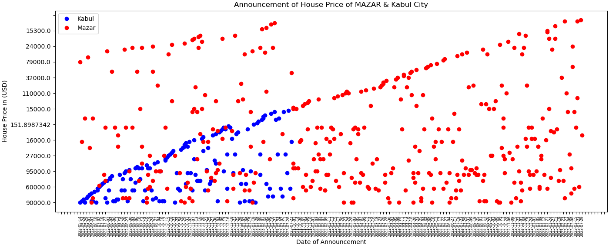

# Telegram “Zamin” Channel Data Analysis

In Telegram, there is a channel called “Zamin”, which means Land, where the admin of the channel announces all houses, apartments and lands are being sold or being put for rent in both Kabul and Mazar-e-sharif provinces of Afghanistan. These announcements every dayhappen one time or more than one time depending on the demands and are in persian language. Every announcement has little bit, but not complete and well-structured information about the sold and rented item.

In this project, the channel data is extracted by using Python script and analyzed to show how many houses are being sold monthly and how much is the price of every house and which location of the cities are more expensive than the others.

## Requirements

To perform this data analysis, we need some programs and packages to be installed on the system and run the codes.
+ Python: to run the “ChannelMessages.py” file in the terminal
+ telethon: to use the connection and get the Telegram data
+ a mobile number: when we run the Python file, it needs a mobile number to send a code to the mobile number and give the code to the execution process to be done.
+ Telegram API account: obiuesly we need a Telegram account to get the data.
  - Telegram API ID: which is configured in config.ini file
  - Telegram API hash: which is configured in config.ini file

After all of these are successfully done, the data in a json file is extracted and downloaded in the current folder. The json file then is red and analyzed in the Jupyter Notebook in my Kaggle account [here](https://www.kaggle.com/code/grzaini/lang-data/edit/run/139341457).

Finally, in this work I have shown how much the houses’ prices are in both cities or individuals. E.g. The following graph shows houses’ princes in Kabul and Mazar cities.

